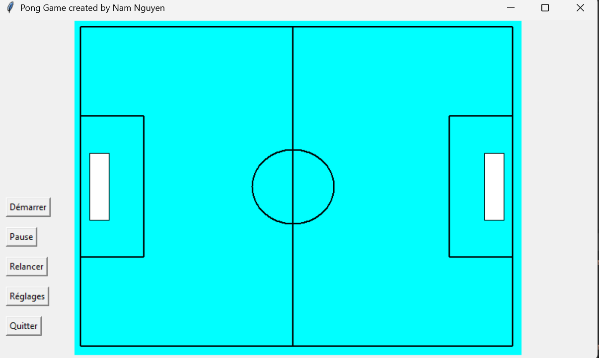
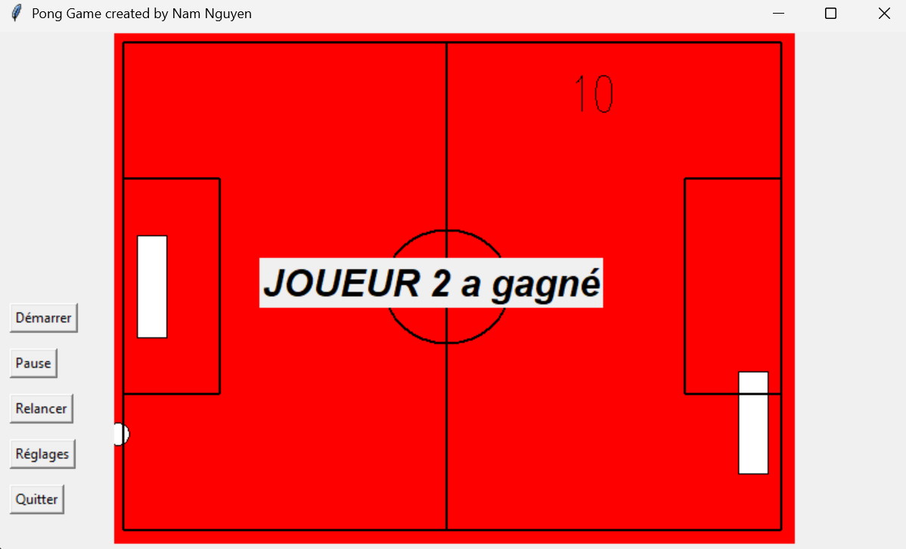

# Pong Game with Tkinter

A Python implementation of the classic Pong game using Tkinter.

## Features

- 1 Player vs AI (bot)
- 2 Player mode (W/S vs ↑/↓)
- Adjustable ball speed (difficulty)
- Changeable court color and game mode
- Simple GUI built with Tkinter

## Here are some screenshots of the game in action:

  
  

